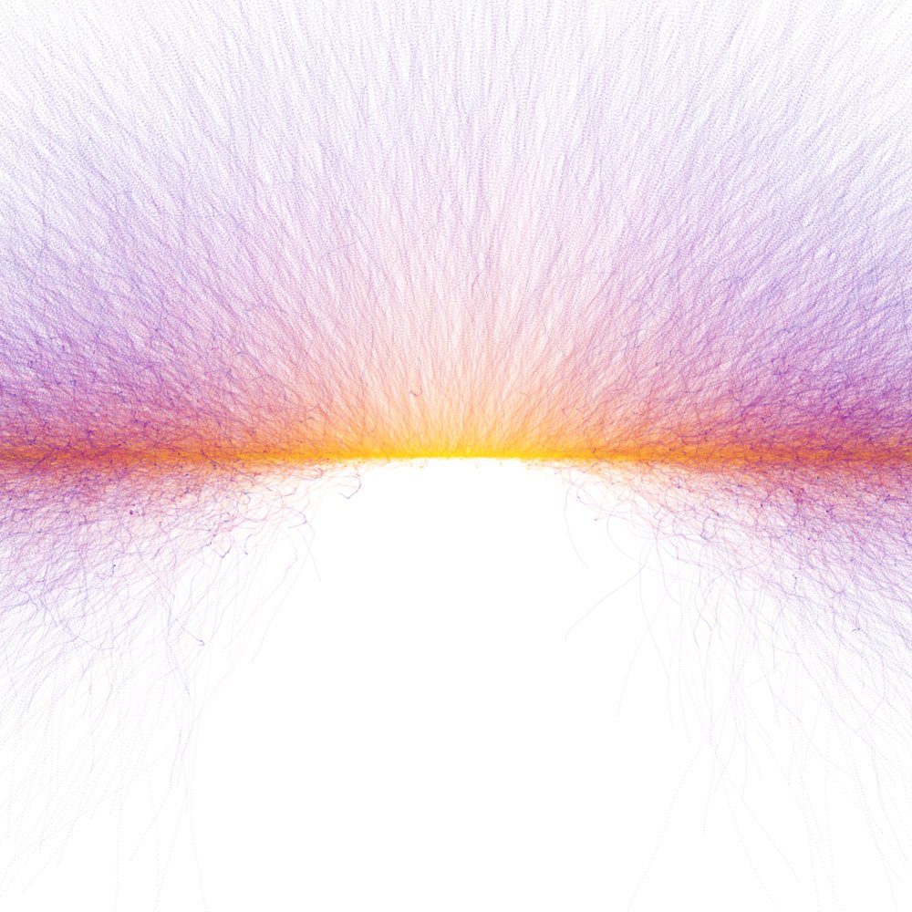

# generative-art

The works focus on generated color palates, iether by kmean clustering of the colors from a sample image, or via random generation. These color palates are then exploded using particle motion.

Heavily inspired and motivated by the work of [Anders Hoff](inconvergent.net) and with code based on his work at his [GitHub](github.com/inconvergent).

At the moment this is a personal project with minimal documentation, but if you want to know more just let me know and I will make more documentation, I just need the excuse :)

## files

### render.py
Includes the classes that handle the actual display and saving of the images. They rely on Gtk to display the drawings in a window, and cairo for the actual image surfaces.

### colormap.py
Generates color spectrums from a selection of colors. These can be random or predefined.

### kmean.py
Uses the python image library to import sample images as data arrays. Then performs k-mean clustering on the arrays to generate color palates. Also has code to display the sample image along with the color palate

### random_color_line.py
Hold the code for the particle motion and evolution, both in color and cartesian space. also can be adapted to include global forces.

### burst_from_kmean.py
A script of the point_burst funtion that uses a pregenerated color palate outputted from kmean.py

### randomburst.py
script of pointburst that uses a random color palate

### gridburst.py
shell script to produce multiple randombursts and then tile them into a single image
